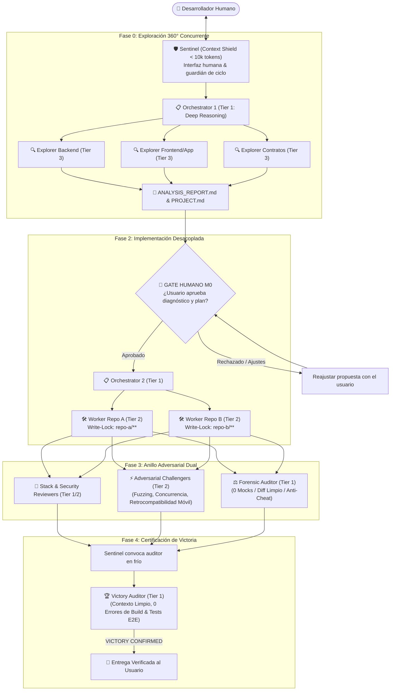

# ⚡ Swarm-Forge

> **Universal Multi-Agent Engineering Protocol & Topology Catalog**  
> *Una arquitectura unificada para orquestar equipos de agentes autónomos con disciplina adversarial, optimización radical de tokens y adaptabilidad a cualquier topología de software.*

---

## 🌟 Visión y Manifiesto

En la era del desarrollo asistido por IA, los agentes autónomos suelen cometer dos errores comunes:
1. **El Enfoque Monolítico:** Un único agente con una ventana de contexto enorme intenta hacer todo: investigar, diseñar, picar código, probar y auto-aprobarse, sufriendo alucinaciones, ceguera por fatiga de contexto y costes desorbitados de tokens.
2. **La Camisa de Fuerza:** Frameworks multi-agente rígidos que obligan a todos los proyectos a tener la misma estructura fija, rompiéndose cuando un proyecto introduce Flutter, microservicios en Python o colas de mensajería.

**Swarm-Forge** nace de la fusión empírica de dos casos de éxito en producción (**Chronus** y **Daido Cloud**) para establecer un **Estándar Universal de Ingeniería Multi-Agente**:

* **Disciplina Adversarial (de Chronus):** Separación estricta de poderes. El que escribe el código nunca es quien lo aprueba. Existen agentes diseñados específicamente para estresar el sistema (*Challengers*) y auditar la victoria en frío (*Victory Auditor*).
* **Eficiencia Radical de Tokens (de Daido Cloud):** Estratificación de inteligencia en 3 Tiers (Deep Reasoning, Fast Precision, Bulk Utility) para recortar más de un 70% del gasto en tokens delegando tareas mecánicas a modelos ultraligeros.
* **Aislamiento de Escritura (*Write-Locks*):** Los workers operan en paralelo sobre archivos disjuntos, eliminando colisiones y conflictos de Git.
* **Un Living Blueprint, NO una Camisa de Fuerza:** Un modelo abierto que instruye al agente adoptante a vigilar la evolución del proyecto y auto-mutar el equipo cuando entran nuevos repos o tecnologías.

---

## 🧭 Dos Modos de Enjambre

Swarm-Forge ejecuta **el mismo protocolo** (5 fases, 12 roles, Write-Locks, Gate M0) de dos maneras. Elige una antes de adoptar:

| | 🏠 **Modo A — Mono-Harness (un solo CLI)** | 🧬 **Modo B — Multi-Harness (varios CLIs)** |
|---|---|---|
| **Lanza los agentes** | Subagentes nativos del CLI (`Task`, `invoke_subagent`, `task`...) | [herdr](https://github.com/ogulcancelik/herdr): un CLI real por pane |
| **Modelos** | Los que ofrezca ese CLI: un proveedor (Claude Code, Codex) o varios (OpenCode, AGY) | Cualquier modelo de cualquier CLI instalado |
| **Asignación de modelos** | [`ROSETTA_STONE.md`](./ROSETTA_STONE.md) | [`catalog/`](./catalog/) + [`tools/recommend-roster.mjs`](./tools/recommend-roster.mjs) → `roster.json` |
| **Adaptador** | `providers/antigravity`, `claude-code`, `codex`, `opencode` | `providers/herdr` |
| **Ideal para** | Setup simple con un solo CLI | Combinar CLIs, jueces independientes, worktrees por worker |

> "Un solo CLI" no siempre es "un solo proveedor": OpenCode y AGY ya permiten mezclar familias de modelos sin herdr.

👉 Guía completa para decidir: [`SWARM_MODES.md`](./SWARM_MODES.md).

---

## 🏛️ Arquitectura del Repositorio

El repositorio está organizado en tres capas desacopladas:

```text
swarm-forge/
├── spec/               # 🌐 ESPECIFICACIÓN PURA (100% Agnóstica a la IA y al Proveedor)
│   ├── PROTOCOL.md     # El ciclo de vida universal en 5 fases
│   ├── ROLES.md        # Definición de los 12 roles del enjambre
│   ├── TOPOLOGIES.md   # Principios de modelado de superficies y repositorios
│   ├── ARTIFACTS.md    # Esquema de DISPATCH.md, BRIEFING.md, handoff.md, etc.
│   ├── TOPOLOGY_DRIFT.md # Algoritmo de vigilancia y evolución continua
│   └── MIXED_ROSTER.md # [Modo B] Rosters multi-harness con herdr
│
├── SWARM_MODES.md      # 🧭 Modo A (un solo CLI) vs. Modo B (varios CLIs): cuál elegir
├── ROSETTA_STONE.md    # 🗿 [Modo A] Mapeo de modelos, thinking y herramientas por CLI
│
├── catalog/            # 🧬 [Modo B] Capacidades de modelos y requisitos por rol
├── tools/              # ⚙️ recommend-roster.mjs [Modo B] y check-write-locks.mjs [ambos modos]
│
├── topologies/         # 🎯 STARTER KITS DE TOPOLOGÍAS (Listos para copiar a cualquier proyecto)
│   ├── 01-dual-surface/        # Chronus style: Backend API + Web SPA
│   ├── 02-multi-microservice/  # Daido Cloud style: 5 APIs, Python, S3, BullMQ
│   ├── 03-omnichannel-quad/    # PasajeYa / Kasah style: API + Web + Backoffice + Mobile Flutter
│   ├── 04-mobile-first-triad/  # Mobile First: API + Landing Web + App Móvil
│   ├── 05-data-ai-pipeline/    # Data Mesh: API + Colas de Workers + LLM / Scraper
│   └── 06-single-repo-monolith/ # funycheck style: Next.js con API y UI en un solo repo
│
└── providers/          # 🔌 ADAPTADORES
    │   ── Modo A: Mono-Harness (un solo CLI) ──
    ├── antigravity/    # 🏆 REFERENCIA DE ORO: Implementación completa para Antigravity (AGY)
    ├── claude-code/    # 🏗️ Cascarón + Prompt de desafío para Claude Code
    ├── codex/          # ✅ Codex CLI: subagentes TOML, sandbox por rol y victoria con `codex exec`
    ├── opencode/       # ✅ OpenCode: agentes con Write-Locks físicos y modelos de varias familias
    │   ── Modo B: Multi-Harness (varios CLIs) ──
    └── herdr/          # 🐑 Enjambres mixtos: cada rol en su propio CLI y modelo, orquestados con herdr
```

---

## 🚀 El Ciclo de Vida Universal Swarm-Forge (5 Fases)



---

## 💡 Principio Rector: "Living Blueprint, NO una Camisa de Fuerza"

Cuando un agente de IA adopta **Swarm-Forge** en un repositorio nuevo:

1. **NO asume una plantilla fija ciega.** Lee [`spec/TOPOLOGY_DRIFT.md`](./spec/TOPOLOGY_DRIFT.md) y ejecuta un escaneo de la verdad del código en disco.
2. **Selecciona el Starter Kit más cercano** del catálogo de [`topologies/`](./topologies/) y **lo customiza**.
3. **Mantiene vigilancia activa:**
   - Si el proyecto suma una app en Flutter, el agente incorpora al `Worker Mobile` y al crucial `Challenger Backward-Compatibility`.
   - Si se añade un microservicio en Python, incorpora linters de Python y el respectivo worker políglota.
   - Si una tarea es menor, apaga los roles innecesarios para no malgastar recursos.

---

## 🗿 Modo A: Mapeo por CLI (Rosetta Stone)

Swarm-Forge no favorece a un proveedor cerrado. Define **Tiers Abstractos de Inteligencia**. En el Modo A eliges **la columna de tu CLI** y todo el enjambre corre dentro de él:

| Tier Abstracto | Rol en el Swarm | Antigravity (AGY) | Claude Code | Codex CLI (OpenAI) | OpenCode |
|---|---|---|---|---|---|
| **Tier 1 (Deep Reasoning)** | Orchestrator, Forensic, Victory Auditor | **Gemini 3.1 Pro** (High) | **Opus** (thinking alto) | **GPT-6 Astra** / **GPT-5.6 Sol** (high) | **GLM-5.3**, **DeepSeek v4 Pro**, **Grok 4.6** |
| **Tier 2 (Fast Precision)** | Workers, Challengers, Code Reviewers | **Gemini 3.8 Flash** (Medium) | **Sonnet** | **GPT-5.6 Terra** (medium) | **Kimi K2.7 Code**, **Grok 4.6** |
| **Tier 3 (Bulk Utility)** | Explorers, Búsqueda, Documentación | **Gemini 3.8 Flash** (Low) | **Haiku** | **GPT-5.6 Luna** (low) | **GLM-5.3 Flash** |

*Vigencia: septiembre 2026.*

Revisa la tabla completa y parámetros en [`ROSETTA_STONE.md`](./ROSETTA_STONE.md).

---

## 🧬 Modo B: Rosters Multi-Harness (herdr)

En el Modo B las columnas de arriba dejan de ser excluyentes, porque cada rol puede correr en un CLI distinto: el Sentinel puede correr en Gemini Flash, los workers en Claude Sonnet y los auditores en DeepSeek o Gemini Pro. Además, un juez de otra familia de modelos detecta errores que el modelo que escribió el código no ve (**Ley de Diversidad Adversarial**, 6ª Ley del protocolo).

La asignación ya no sale de la Rosetta Stone, sino de un catálogo de capacidades que el recomendador cruza con los CLIs que tienes instalados:

```bash
node tools/recommend-roster.mjs --topology topology.json --profile balanced --out roster.json
node providers/herdr/swarm-up.mjs --roster roster.json --phase 0 --apply
```

Puedes operarlo a mano, con el script, o dejar que tu agente principal dirija al resto (**Agente-Director**, [`SENTINEL_PROMPT.md`](./providers/herdr/SENTINEL_PROMPT.md)).

Especificación en [`spec/MIXED_ROSTER.md`](./spec/MIXED_ROSTER.md); instalación y operación en [`providers/herdr/`](./providers/herdr/).

---

## 🛠️ Cómo Adoptar Swarm-Forge en tu Proyecto

### Paso 0: Elige el Modo
¿Un solo CLI (Modo A) o varios CLIs coordinados con herdr (Modo B)? Ver [`SWARM_MODES.md`](./SWARM_MODES.md).

### Paso 1: Identifica tu Topología
Revisa las carpetas en [`topologies/`](./topologies/):
- ¿Solo backend y frontend web? Usa [`01-dual-surface`](./topologies/01-dual-surface/).
- ¿Múltiples APIs y microservicios? Usa [`02-multi-microservice`](./topologies/02-multi-microservice/).
- ¿API, web pública, backoffice y app móvil? Usa [`03-omnichannel-quad`](./topologies/03-omnichannel-quad/).
- ¿Un solo repo donde la API y la UI conviven (Next.js App Router)? Usa [`06-single-repo-monolith`](./topologies/06-single-repo-monolith/).

### Paso 2: Copia el Manifiesto Base
Copia el archivo `AGENTS.template.md` (o equivalente de tu proveedor) a la raíz de tu proyecto como `AGENTS.md` (para AGY/Codex) o `CLAUDE.md` (para Claude Code).

### Paso 3: Adapta los Write-Locks y Comandos de Build
Ajusta las rutas relativas de tus carpetas y los comandos de compilación estricta (`tsc --noEmit`, `flutter analyze`, `pytest`, `cargo test`).

### Paso 4: Asigna los Modelos
- **Modo A:** usa la columna de tu CLI en [`ROSETTA_STONE.md`](./ROSETTA_STONE.md).
- **Modo B:** copia también `topology.json`, genera tu `roster.json` con [`tools/recommend-roster.mjs`](./tools/recommend-roster.mjs) y sigue [`providers/herdr/README.md`](./providers/herdr/README.md).

---

## 🤝 Contribuciones y Ecosistema

Este repositorio es una iniciativa abierta. Los adaptadores para cada proveedor se desarrollan desafiando a sus respectivas IAs utilizando los `BOOTSTRAP_PROMPT.md` en [`providers/`](./providers/).
