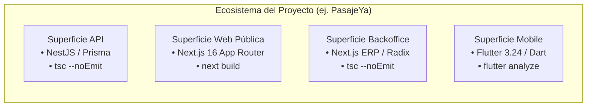

# 🗺️ Especificación Universal: Modelado de Topologías y Superficies

Este documento explica cómo Swarm-Forge modela arquitecturas de software reales —desde monolitos web simples hasta ecosistemas omnicanal con múltiples repositorios— y cómo se asignan los equipos dinámicamente.

---

## 1. El Concepto de "Superficie de Ejecución" (*Execution Surface*)

En Swarm-Forge, un proyecto no se define por un "backend y un frontend" genéricos, sino por un conjunto discreto de **Superficies de Ejecución**:

Una **Superficie** es una unidad de software con:
1. **Un repositorio o directorio raíz independiente.**
2. **Un stack tecnológico y lenguaje específico.**
3. **Un comando de verificación estricta propio** (`tsc`, `flutter analyze`, `pytest`, `cargo test`).
4. **Una frontera de archivos delimitada** (para aplicar Write-Locks).



---

## 2. El Manifiesto de Topología (`topology.json`)

Cada proyecto que adopta Swarm-Forge define en su raíz un archivo `topology.json` (o la sección equivalente en `AGENTS.md` / `CLAUDE.md`).

### Esquema Estándar:

```json
{
  "$schema": "https://swarm-forge.org/schemas/topology.v1.json",
  "name": "NombreDelEcosistema",
  "version": "1.0.0",
  "surfaces": {
    "api": {
      "path": "servicios/api-core",
      "stack": "node-nestjs-prisma",
      "language": "typescript",
      "verifyCommand": "pnpm --filter api-core run build",
      "workerRole": "worker_backend"
    },
    "web": {
      "path": "apps/portal-web",
      "stack": "nextjs-tailwind",
      "language": "typescript",
      "verifyCommand": "pnpm --filter portal-web run build",
      "workerRole": "worker_frontend"
    },
    "mobile": {
      "path": "apps/mobile-flutter",
      "stack": "flutter-bloc",
      "language": "dart",
      "verifyCommand": "flutter analyze",
      "workerRole": "worker_mobile"
    }
  },
  "sharedContracts": [
    {
      "source": "api",
      "destinations": ["web", "mobile"],
      "contractPath": "packages/api-contracts"
    }
  ],
  "requiredChallengers": [
    "challenger_routing",
    "challenger_backward_compat"
  ]
}
```

### Superficies que comparten repositorio (`paths` + `exclude`)

Cuando dos superficies viven **dentro del mismo repositorio** (p. ej. un monolito Next.js donde la API vive en `src/app/api/**` y la UI en el resto de `src/app/**`), una sola `path` no alcanza. En ese caso la superficie declara su frontera con globs:

```json
"frontend": {
  "paths": ["src/app/**", "src/components/**", "public/**"],
  "exclude": ["src/app/api/**"],
  "stack": "nextjs-app-router-tailwind",
  "language": "typescript",
  "verifyCommand": "pnpm lint && npx tsc --noEmit",
  "workerRole": "worker_frontend"
}
```

| Campo | Significado |
|---|---|
| `path` | Forma corta: equivale a `paths: ["<path>/**"]`. Sigue siendo válida. |
| `paths` | Globs que el worker **puede** escribir. |
| `exclude` | Globs que el worker **no puede** escribir aunque coincidan con `paths`. Siempre ganan sobre `paths`. |

**Regla de disjunción:** una vez aplicados los `exclude`, ningún archivo puede quedar dentro de la frontera de dos workers. Los archivos que no pertenecen a ninguna superficie (p. ej. `package.json`) solo se tocan si el orchestrator los asigna explícitamente en el `DISPATCH.md` (normalmente a `devops`).

### Superficies en repositorios independientes (`repo`)

Un ecosistema puede vivir en varios repositorios git **sin una raíz común versionada** (p. ej. `crm/crm-backend/` y `crm/crm-frontend/`, cada uno con su propio `.git`, bajo una carpeta `crm/` que no lo es). Cada superficie declara entonces de qué repo es:

```json
"backend": {
  "repo": "crm-backend",
  "path": "crm-backend",
  "stack": "node-express-prisma",
  "language": "typescript",
  "verifyCommand": "npx prisma generate && pnpm test",
  "workerRole": "worker_backend"
}
```

| Campo | Significado |
|---|---|
| `repo` | Carpeta, relativa a la raíz de la topología, que es **su propio repositorio git**. Si se omite, la superficie vive en el repo de la raíz (comportamiento de siempre; retrocompatible). |

Efectos de declarar `repo`:
- **[`tools/check-write-locks.mjs`](../tools/check-write-locks.mjs)** lista los cambios con `git -C <raíz>/<repo>` en vez de asumir que la raíz es el repo, y antepone `<repo>/` a cada ruta antes de compararla con `paths`/`exclude` (que siguen siendo relativos a la raíz de la topología, como en cualquier otra superficie). Ejecútalo desde la raíz de la topología o pásale `--root <raíz>`.
- **[`providers/herdr/swarm-up.mjs`](../providers/herdr/swarm-up.mjs)** abre la pestaña del worker en `<raíz>/<repo>`, y con `--worktree` crea el worktree desde ese repo (con `--base <ref>` parte de esa rama, p. ej. `origin/main`). El worker queda en un checkout aislado de **ese** repo: el Write-Lock pasa a ser físico por partida doble (no puede escribir en el otro repo porque ni siquiera está en su checkout). Si un writer sin `repo` pide worktree y la raíz no es un repo git, el lanzador lo rechaza antes de crear nada.
- **`verifyCommand` se ejecuta desde la raíz de su repo**, no desde la raíz de la topología: escribe `pnpm test`, no `pnpm --filter backend test`. El brief del worker se lo indica, junto con su Write-Lock ya expresado en rutas relativas a su repo.
- Si **ninguna** superficie declara `repo`, nada cambia: es el mismo comportamiento mono-repo de siempre.

### Roles de infraestructura (`infraRoles`)

Los roles `dba` y `devops` ([`ROLES.md`](ROLES.md) #11-12) no pertenecen a una superficie: la topología los pide explícitamente y el recomendador los asigna en la fase 2, como writers.

```json
"infraRoles": [
  "devops",
  {
    "role": "dba",
    "repo": "crm-backend",
    "paths": ["crm-backend/prisma/**"],
    "verifyCommand": "npx prisma validate"
  }
]
```

- **Forma corta** (`"devops"`): el rol no tiene Write-Lock propio; cada `DISPATCH.md` le asigna qué archivos puede tocar (típicamente los huérfanos: `package.json`, `Dockerfile`, CI). `check-write-locks --role devops` no puede verificarlo y lo dice.
- **Forma objeto**: acepta los mismos campos que una superficie (`repo`, `path`/`paths`, `exclude`, `verifyCommand`). Su frontera entra en la **regla de disjunción**: si el `dba` es dueño de `crm-backend/prisma/**`, la superficie backend debe excluirlo (`"exclude": ["crm-backend/prisma/**"]`).
- **Polyrepo + `--worktree`:** un rol de infraestructura sin `repo` se lanzaría en la raíz, que no es un repo git; declárale `repo` o lánzalo sin `--worktree` (`--roles devops`).
- Cuándo pedirlos: `dba` si el proyecto tiene migraciones o esquema (`prisma/`, `alembic/`, `migrations/`); `devops` si hay `Dockerfile`, CI o despliegue (Coolify, compose) que vayan a cambiar.

---

## 3. Principio de Despacho Topológico (*Topology-Aware Dispatch*)

Cuando el `Orchestrator` recibe un requerimiento:
1. **Evalúa qué superficies están impactadas:**
   - Si la tarea solo toca el formulario de perfil web, **solo despacha a `worker_frontend`**.
   - Si la tarea cambia la autenticación y afecta la API y la app móvil, **despacha en paralelo a `worker_backend` y `worker_mobile`**, activando además al `contract-integrator` y al `challenger_backward_compat`.
2. **Cero Desperdicio de Tokens:**
   - Las superficies no involucradas permanecen dormidas. No se crean agentes pasivos que consuman ventana de contexto.

---

## 4. El Catálogo de Topologías de Referencia

Swarm-Forge incluye 6 plantillas pre-construidas en el directorio `topologies/`:

| Plantilla | Estructura | Repositorios Típicos | Caso de Uso |
|---|---|---|---|
| **`01-dual-surface`** | 2 Superficies | `backend`, `frontend` | SaaS web estándar (estilo Chronus). |
| **`02-multi-microservice`** | 4-6 Superficies | `api`, `web`, `multimedia`, `scrapper` (Python), `mailer` | Plataformas cloud desacopladas (estilo Daido Cloud). |
| **`03-omnichannel-quad`** | 4 Superficies | `api`, `web-portal`, `backoffice-erp`, `mobile-app` | Marketplaces, venta de pasajes o ERP con apps (estilo PasajeYa / Kasah). |
| **`04-mobile-first-triad`** | 3 Superficies | `api`, `landing-web`, `mobile-app` | Apps B2C centradas en dispositivos móviles. |
| **`05-data-ai-pipeline`** | 3 Superficies | `api-gateway`, `task-workers`, `ai-service` (LLM/Python) | Procesamiento masivo de datos, colas y pipelines de IA. |
| **`06-single-repo-monolith`** | 2 Superficies en 1 repo | `src/app/api/**` + resto de `src/` (con `paths` / `exclude`) | Monolitos Next.js App Router (estilo funycheck). |
