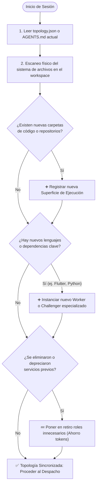

# 👁️ Especificación Universal: Vigilancia Continua y Detección de Deriva de Topología (*Topology Drift Detection*)

> **Regla de Oro:** *Un enjambre Swarm-Forge es un organismo vivo. No es una camisa de fuerza fija. Todo agente que opere en un repositorio debe vigilar activamente si la arquitectura del proyecto ha cambiado y reconfigurar el equipo según corresponda.*

---

## 1. El Algoritmo de Detección de Deriva (Fase 0)

Cada vez que el `Sentinel` u `Orchestrator` inicia una nueva sesión de trabajo en un proyecto, **antes de despachar a los workers**, debe ejecutar el siguiente ciclo de inspección:

---

## 2. Eventos Típicos de Deriva y Acciones Obligatorias

### Caso A: Detección de una Nueva Aplicación Móvil
- **Señal:** Aparece un directorio con `pubspec.yaml` (Flutter) o `android/` / `ios/` (React Native/Capacitor).
- **Acciones del Agente:**
  1. Registra la superficie `mobile` en `topology.json`.
  2. Crea el rol `worker_mobile` con Write-Lock estricto sobre esa carpeta.
  3. **Obligatorio:** Activa el rol `challenger_backward_compat` en el Anillo Adversarial para verificar que las versiones anteriores de la app no mueran con cambios en la API.
  4. Instruye al `contract-integrator` a validar los modelos cliente (Dart / TypeScript) contra el backend.

### Caso B: Detección de un Nuevo Microservicio o Lenguaje Heterogéneo
- **Señal:** Aparece un servicio con `pyproject.toml` o `requirements.txt` (Python/FastAPI) en un ecosistema que era puramente Node.js/TypeScript.
- **Acciones del Agente:**
  1. Registra la superficie del nuevo microservicio.
  2. Añade un worker políglota con conocimiento del framework específico.
  3. Modifica la regla de compilación estricta para incluir las herramientas nativas del nuevo lenguaje (ej. `pytest`, `ruff`, `mypy`).
  4. Si usa ORM distinto (ej. SQLAlchemy/Alembic vs Prisma), instruye al `dba` para supervisar migraciones en ambos dialectos.

### Caso C: Detección de un Repositorio de Backoffice Separado
- **Señal:** Se añade un portal administrativo interno (`apps/admin`, `pasajeya-bo`).
- **Acciones del Agente:**
  1. Desacopla las responsabilidades: el `worker_frontend` atiende el portal público de clientes y se crea el `worker_backoffice` para el panel interno.
  2. El `security-auditor` añade comprobaciones de roles RBAC (SuperAdmin vs Operador vs Usuario).

### Caso D: Regresión de Presupuesto (Desperdicio de Tokens)
- **Señal:** Se observa que tareas simples de documentación o búsqueda están ejecutándose con modelos Tier 1 (Gemini Pro, Claude Sonnet con 16k thinking, OpenAI o3-mini).
- **Acciones del Agente:**
  1. Alerta la anomalía en el informe de sesión.
  2. Reasigna inmediatamente la tarea al Tier 3 (Gemini Flash-Lite, Claude Haiku, GPT-4o-mini).

---

## 3. Protocolo de Actualización del Manifiesto Local

Cuando el agente detecta una deriva en la topología:
1. **Actualiza `topology.json` y el archivo de gobernanza local (`AGENTS.md` o `CLAUDE.md`).**
2. Incluye una nota en el `ANALYSIS_REPORT.md` (Gate M0) notificando al desarrollador humano:
   > *"Nota de Arquitectura Swarm: Se ha detectado la incorporación del repositorio [nombre-repo] en [ruta]. El equipo multi-agente ha sido reconfigurado automáticamente añadiendo el rol [nombre-rol] y activando las verificaciones de [tipo-prueba]."*
3. Con la aprobación humana del M0, la nueva topología queda oficializada en el historial de Git.
